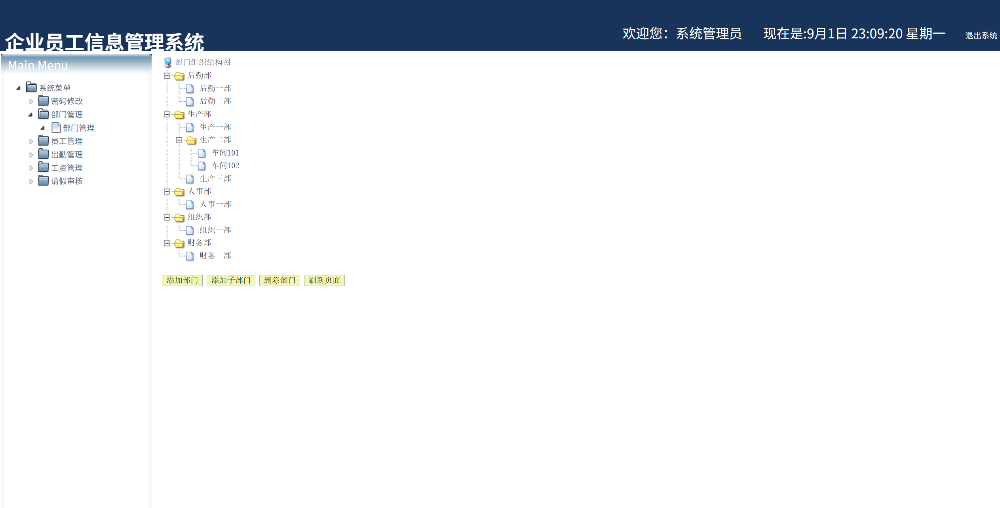
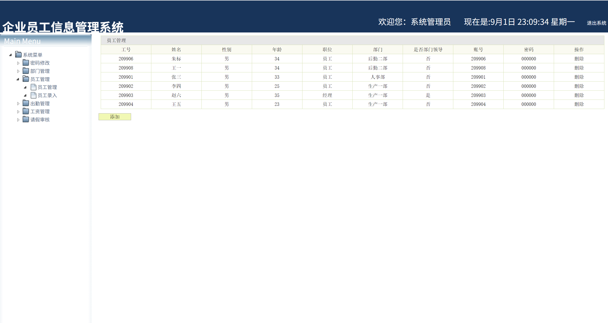
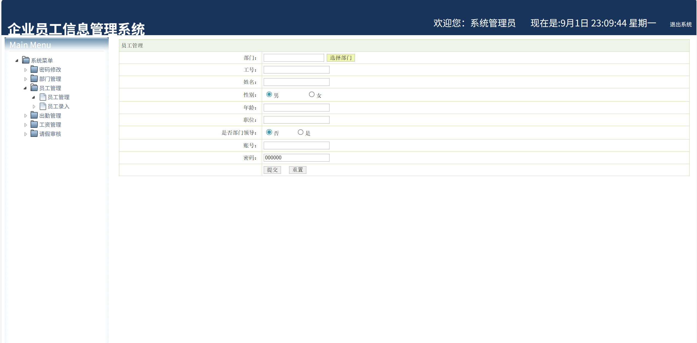
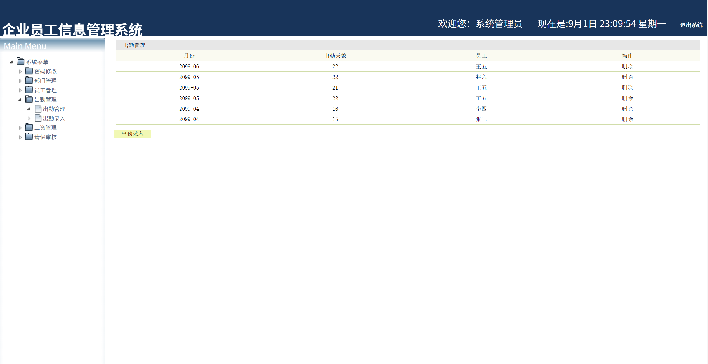
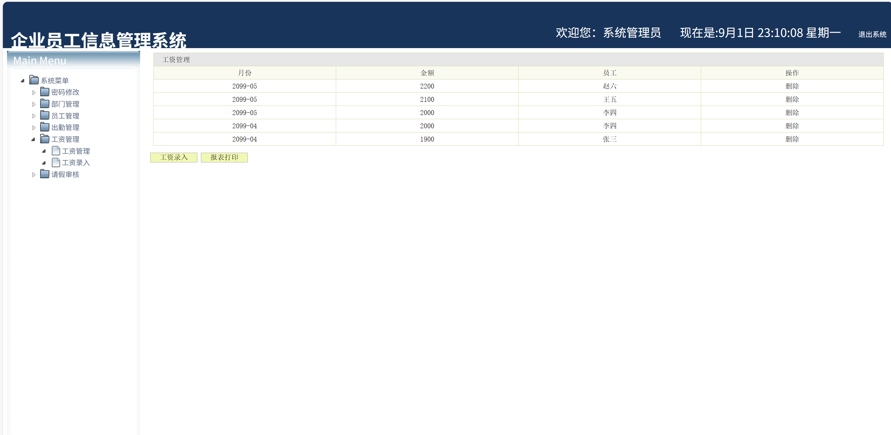
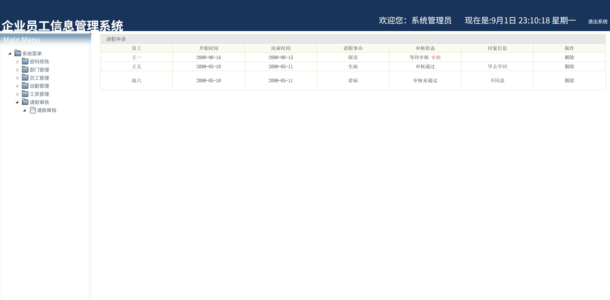
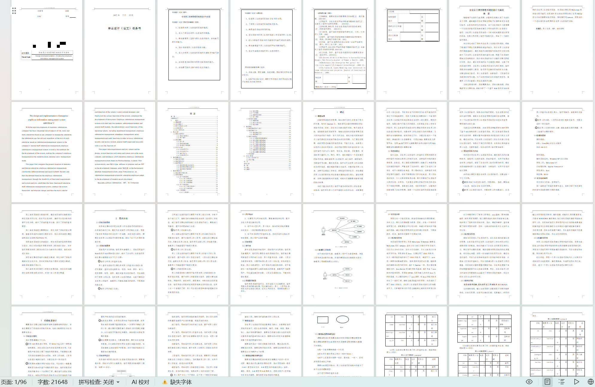

# jspServlet024
jspServlet024企业员工管理系统+BG+PPT
 
## 源码问题查看主页咨询

### 一、关键词

企业员工管理系统，员工管理系统

### 二、作品包含
源码+数据库+设计报告文档+PPT+全套环境和工具资源+本地部署教程

### 三、项目技术
前端技术：Html、Css、Js、Jquery、Bootstrap
后端技术：Java、JSP、Servlet、JDBC

### 四、运行环境（以下版本亲测，其他版本兼容性请自行测试）
开发工具：IDEA/eclipse

数据库：MySQL5.7或8.0

服务器：Tomcat8.5或Tomcat9.0

数据库管理工具：Navicat10以上版本

环境配置软件： JDK1.8

浏览器：谷歌浏览器

### 五、项目介绍
项目编号：jspServlet024

随着电子信息的飞速发展，计算机已经融入到了生活的各个方面，越来越多的企业开始使用电子计算机来对企业进行管理，信息化的时代已经到来，各个企业无论大小都需要一个信息化的管理系统来对自己公司内部的员工信息进行管理，企业员工信息管理系统是一个针对此问题而进行开发的系统，使得公司的员工管理不如现代化，开启了一个新的管理模式。

企业员工信息管理系统分为两大模块，管理员模块和普通员工模块，管理员可以操作系统的所有功能，主要包括部门管理、员工信息管理、出勤管理、工资管理以及请假审核等功能；为了信息的保密以及系统的安全性，普通员工只具有查看工资以及请假的功能。

### 六、运行截图

